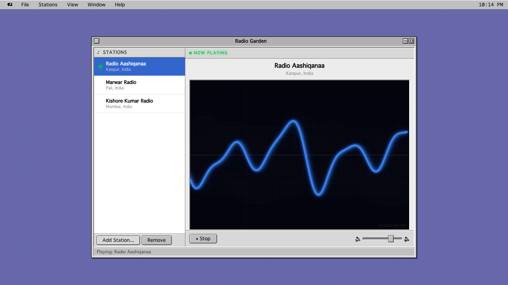

# Radio Garden

A retro Mac OS 9-styled internet radio player. Click a station, hear it play.

**[Live Demo](https://sunil-dhaka.github.io/radio-garden/)**

## Features

- 3 pre-loaded Indian radio stations (add your own via radio.garden URLs)
- 4 audio visualizer modes: Rainbow Spectrum, VU Meter, CRT Phosphor, Oscilloscope
- Authentic Mac OS 9 Platinum UI with draggable windows, menus, and Balloon Help
- Stations persist in localStorage across sessions
